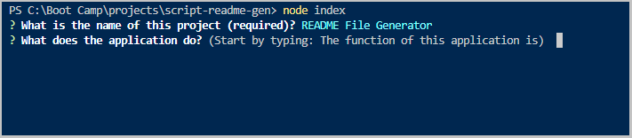

  
  # README File Generator 

  

  ## Description

  The function of this application is to create a README file based on user input. It will ask a series of questions and then build the file around the user's response. This will save time and ensure that nothing is missed in the README file.

  The technologies used in the development or operation of this application include Node.js as the runtime environment and the Inquirer module to produce the question and response functionality.
  
  The challenges of developing this application include understanding the use of promises and properly displaying the badges.
    
  Future development of this application will introduce flashier prompts (typerwriter-effect module). It will also look at breaking the steps on a single question out to separate lines. Finally, it will look at havign starter text instead of the current recommended text which the user has to re-type. The Inquirer module's prefix, suffix, and default functions do not provide this.

  ## Table of Contents

  * [Installation](#installation)

  * [Usage](#usage)

  * [Screenshots](#screenshots)

  * [Video](#video)

  * [License](#license)

  * [Contributors](#contributors)

  * [Tests](#tests)

  * [Questions](#questions)

  ## Installation

  1. Download and install the recommended version of Node. 2. Install the Inquirer module.

  ## Usage

  1. Execute Node (node index). 2. Answer the questions. 3. Open the README file. Marvel at your masterpiece.

  ## Screenshots

  

  

  ## Video

  This video demonstrates the operation and output of the README File Generator. There are some examples of responses being typed, but most of them were pre-entered to speed up the video.

  https://drive.google.com/file/d/1hKo5JyTWlsW9IwoqKW5yb8aLqGLM11ll/view?usp=sharing

  ## License

    This project is licensed under the MIT license.

  ## Contributors

  Research was mostly through articles on GeeksforGeeks which helped a lot with this project.
  
  ## Tests

  Testing involved running through without answering all of the questions, then answering all of the questions, and choosing different licenses to test all of the badges.

  ## Questions

  If you have any questions about this app, please send them to danielmarkwilliams@gmail.com.

  You can explore my work by going to [Coridane](https://github.com/Coridane/).

